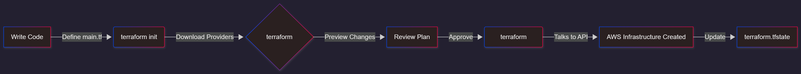

# What is Infrastructure as Code (IaC)?

**Infrastructure as Code (IaC)** is exactly what it sounds like: managing and provisioning your infrastructure through **code** instead of manual processes.

Imagine you need to deploy a web server.

### **The Old Way**
You log in, click buttons, configure security groups manually, and launch the server.  
If you need 10 more, you repeat that process 10 times (and hope you don't make a mistake).

### **The IaC Way**
You write a configuration file describing the server.  
To get 10 servers, you just change a number in the code from **1 to 10**.

IaC brings the best practices of software development—like **version control (Git), peer reviews, and automated testing**—into the world of operations.

---

# Declarative vs. Imperative: A Key Distinction

One of the most important concepts is the difference between **Declarative** and **Imperative** programming.

### **Imperative (The "How")**
This is like a script. You give specific step-by-step instructions.

**Example:**
- Go to the kitchen  
- Open the fridge  
- Get eggs  
- Crack eggs  
- Fry eggs  

### **Declarative (The "What") – Terraform**
You define the **end state**, not the steps.

**Example:**  
"I want two fried eggs on my plate."

Terraform is **Declarative**.  
You tell it:  
> "I want an EC2 instance with this IP address,"  
and Terraform figures out how to make that happen.

---

# Terraform's Biggest Strengths

- Works with multiple cloud providers (**AWS, Azure, GCP…**)  
- Uses a simple language: **HCL (HashiCorp Configuration Language)**  
- Creates an **execution plan** before applying changes  
- Maintains a **state file** to track resources over time  

---

# Terraform Workflow (Very Important)

Write → Init → Plan → Apply → Destroy


---

## 1️⃣ **Write**
Create Terraform configuration files (`.tf`) describing resources.

## 2️⃣ **Init**
Initializes the directory and downloads the provider plugins.

```terraform init```

## 3️⃣ **Plan**

Shows what Terraform will create, modify, or delete.

```terraform plan```

## 4️⃣ **Apply**

Deploys the infrastructure on AWS.

```terraform apply```

## 5️⃣ **Destroy**

Removes all resources created by Terraform.

```terraform destroy```
